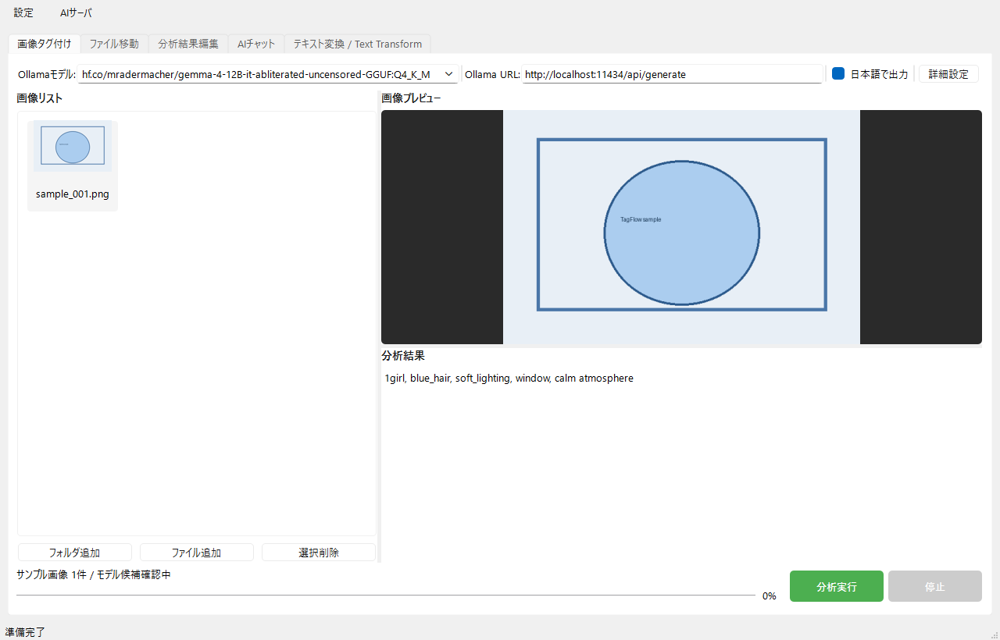
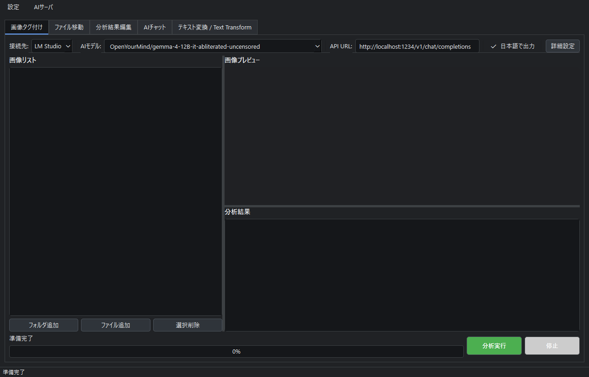
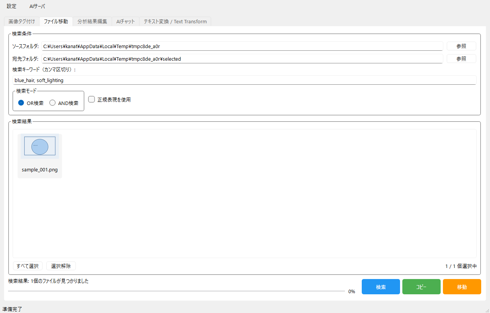
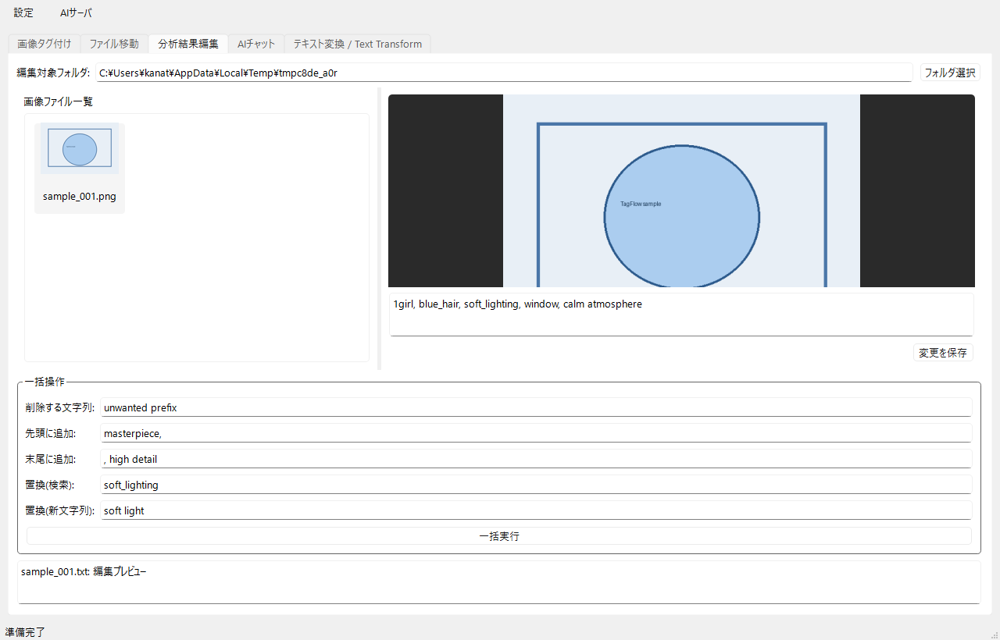
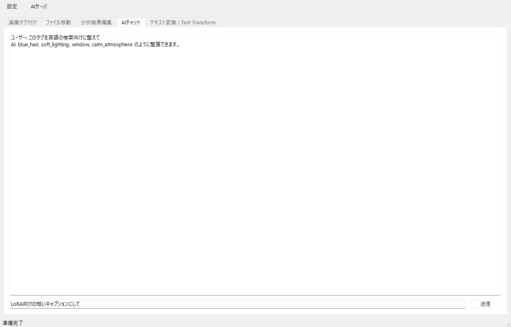
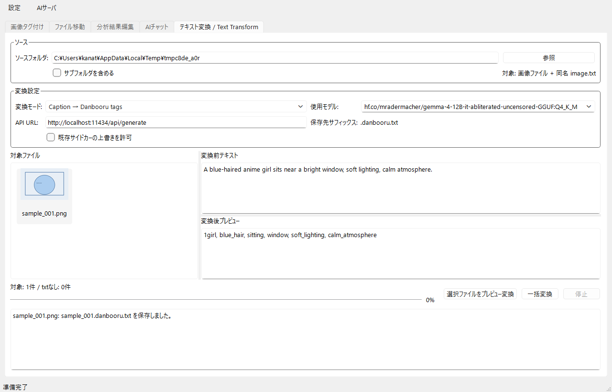
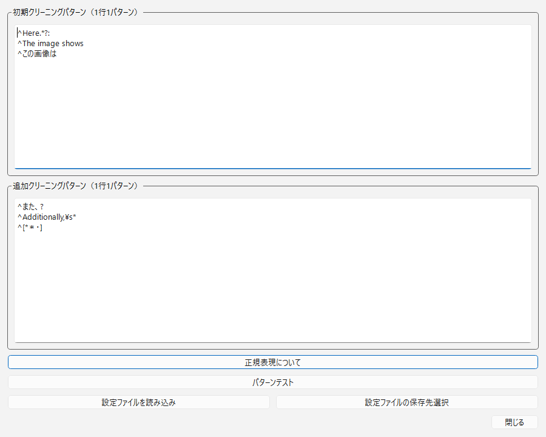
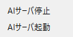

# TagFlow: AI画像タグ付け・ファイル整理ツール

TagFlow は、画像の説明文や検索用タグを生成し、生成した `.txt` をもとに画像を検索、コピー、移動、一括編集できる Windows 向けデスクトップアプリです。AI接続先として、ローカルの `Ollama` / `LM Studio`、従量課金の `OpenAI API`、ChatGPT サブスクリプションで認証した `Codex CLI` を選択できます。

既定の localhost 構成で Ollama または LM Studio を使う場合、画像と入力テキストは手元のローカルサーバだけへ送信されます。OpenAI API または Codex CLI を選んだ場合、選択した画像と入力テキストは OpenAI へ送信されます。用途、機密性、速度、費用に応じて接続先を切り替えてください。

## 現在の対応状況

2026-07-11 時点の実装では、画像タグ付け、AIチャット、テキスト変換で次の4接続先を選択できます。

- `Ollama（ローカル）`: `http://localhost:11434/api/generate`
- `LM Studio（ローカル）`: `http://localhost:1234/v1/chat/completions`
- `OpenAI API（従量課金）`: `https://api.openai.com/v1/responses` と環境変数 `OPENAI_API_KEY`
- `ChatGPTサブスク（Codex CLI）`: ChatGPT でログイン済みの公式 Codex CLI を `codex exec` で非対話実行

ChatGPT サブスクリプションと OpenAI API は別経路です。OpenAI API の利用料は ChatGPT 契約とは別に管理されます。サブスクリプション経路では ChatGPT Web 画面の自動操作、Cookie、ブラウザセッションの流用は行わず、公式 Codex CLI の ChatGPT 認証を使用します。

APIキー、Codexのアクセストークン、ログインキャッシュは `app_config.json` に保存しません。OpenAI API URL はキー送信先を固定するため、公式 Responses API の HTTPS URL だけを許可します。

LM Studio 選択時、TagFlow は `ollama serve` を自動起動しません。LM Studio アプリ、または `lms server start` でサーバを起動してください。ダークモードは `設定 > テーマ > ダークモード` から切り替えできます。

## できること

- 画像をドラッグ＆ドロップし、ローカルAI、OpenAI API、または ChatGPTサブスク経由の Codex CLI で説明文やタグを生成する。
- 生成結果を画像と同じフォルダの `.txt` ファイルとして保存する。
- `.txt` 内のタグや説明文を検索して、該当画像をまとめてコピーまたは移動する。
- 画像に対応する `.txt` を個別編集、またはフォルダ単位で一括編集する。
- 選択中のAI接続先とテキストチャットして、タグ付け方針や分類ルールを相談する。
- 削除パターンを GUI で管理し、LLM が出しがちな前置き文を自動整形する。
- モデル候補とプロンプト候補を JSON プリセットで管理する。
- 既存の `image.txt` を入力にして、翻訳、Danbooru タグ化、自然文プロンプト化、LoRA キャプション化を行う。
- 変換結果を `image.en.txt` や `image.danbooru.txt` などのサイドカーファイルとして保存する。
- `設定 > テーマ` からライトモードとダークモードを切り替える。

## 想定ユースケース

| 用途 | 使い方 | 効果 |
| --- | --- | --- |
| SNS 投稿用写真の整理 | 写真に説明タグを付け、人物、場所、雰囲気で検索 | 手作業の目視選別を短縮 |
| AI 学習データ整備 | 画像ごとにタグ `.txt` を生成し、一括置換で表記ゆれを直す | キャプション作成とクリーニングを効率化 |
| 商品画像管理 | 商品カテゴリ、色、形、状態をタグ化し、検索でフォルダ分け | EC 登録前の素材整理を高速化 |
| 旅行写真アルバム | 場所、イベント、食事、景色などで自動分類 | 後から探しやすい写真棚卸し |
| 社内画像の安全管理 | 顔、書類、ホワイトボードなどを検出し、対象画像を移動 | 公開前チェックの補助 |
| 素材ライブラリ運用 | 背景、ポーズ、構図、色味などをタグ化 | 制作素材を再利用しやすくする |
| 画像生成プロンプト資産化 | 生成済みキャプションを英語プロンプト、Danbooru タグ、LoRA キャプションへ変換 | 画像素材を学習・生成ワークフローへ再利用しやすくする |
| 日英混在データ整理 | 日本語キャプションを英語へ、英語キャプションを日本語へ変換 | 検索用テキストと学習用テキストを用途別に持てる |

## 全体の流れ

1. 使用する接続先を準備する。Ollama / LM Studio はローカルサーバを起動し、OpenAI API は `OPENAI_API_KEY` を設定し、ChatGPTサブスク経路は `codex login` を完了する。
2. TagFlow を起動する。
3. `画像タグ付け` タブへ画像またはフォルダを追加する。
4. 接続先、モデル、API URLまたはCodexコマンド、日本語出力、詳細設定、プロンプト候補を選ぶ。
5. `分析実行` で画像ごとに `.txt` を生成する。
6. 必要に応じて `テキスト変換 / Text Transform` タブで `.txt` を翻訳、Danbooru タグ化、プロンプト化する。
7. `ファイル移動` タブで `.txt` の内容を検索し、画像と `.txt` をまとめてコピーまたは移動する。
8. `分析結果編集` タブでタグの不要語削除、接頭辞、接尾辞、置換を行う。

## 画面と機能

### 画像タグ付けタブ

画像分析の中心になるタブです。

主な操作:

- 画像ファイルまたはフォルダをリストへ追加する。
- 複数画像をまとめて分析する。
- 選択画像だけを分析する。
- 分析中に処理を停止する。
- 画像プレビューと分析結果を確認する。
- 画像と同名の `.txt` に分析結果を保存する。

対応画像形式:

- `.jpg`
- `.jpeg`
- `.png`
- `.gif`
- `.bmp`
- `.webp`
- `.heic`
- `.avif`

HEIC/AVIF を扱う場合は `pillow_heif` が必要です。



### AI接続先とモデル候補

ツールバーの `接続先` で4種類のバックエンドを選びます。

| 接続先 | 接続欄の初期値 | 認証・課金 | 送信先 / 形式 |
| --- | --- | --- | --- |
| `Ollama（ローカル）` | `http://localhost:11434/api/generate` | 通常は不要 | Ollama generate API |
| `LM Studio（ローカル）` | `http://localhost:1234/v1/chat/completions` | 通常は不要 | OpenAI互換 Chat Completions API |
| `OpenAI API（従量課金）` | `https://api.openai.com/v1/responses` | `OPENAI_API_KEY`、API従量課金 | OpenAI Responses API |
| `ChatGPTサブスク（Codex CLI）` | `codex` | `codex login` でChatGPT認証、契約プランの利用上限 | `codex exec` + ローカル画像パス |

`接続先` を切り替えると、接続欄が既定値のままなら対応する URL または Codex コマンドへ切り替わります。Ollama / LM Studio / Codex CLI の欄は編集できます。OpenAI API は認証キーの誤送信を防ぐため、公式 Responses API URL に固定されます。TagFlow は選択した接続先だけを呼び、失敗時に別の接続先へ自動フォールバックしません。

ChatGPT Web を汎用APIとして直接呼び出す機能ではありません。サブスクリプション利用は、ChatGPT で認証済みの公式 Codex CLI を1リクエストごとに非対話実行する方式です。APIキーで Codex CLI にログインした場合はサブスクリプション利用ではなく、API側の課金になります。

`AIモデル` は編集可能なコンボボックスです。候補は `presets/model_presets.json` から読み込まれます。

初期候補:

| ラベル | モデル名 | 用途 |
| --- | --- | --- |
| GPT-5.6 / OpenAI API（Vision） | `gpt-5.6` | OpenAI Responses APIでの画像説明、タグ化、翻訳 |
| Gemma 4 12B Vision / 画像説明・変換 標準 | `gemma4:12b` | 画像説明、タグ化、自然文プロンプト化の標準候補 |
| Gemma 4 E4B Vision / 軽量マルチモーダル | `gemma4:e4b` | 軽量寄りの画像説明/タグ化 |
| Qwen3-VL 8B / 画像理解バランス | `qwen3-vl:8b` | 画像理解とタグ化のバランス候補 |
| Qwen3-VL 4B / 軽量画像理解 | `qwen3-vl:4b` | 軽量な画像理解候補 |
| TranslateGemma 12B / 翻訳 標準 | `translategemma:12b` | 日本語/英語翻訳の標準候補 |
| TranslateGemma 4B / 軽量翻訳 | `translategemma:4b` | 高速な翻訳プレビューや大量処理 |
| OpenYourMind Gemma 4 12B Abliterated Uncensored / GGUF Q4_K_M | `hf.co/mradermacher/gemma-4-12B-it-abliterated-uncensored-GGUF:Q4_K_M` | Ollamaから試す量子化候補 |
| Gemma 3 27B Vision / 既存互換 | `gemma3:27b` | 高精度寄りの画像説明 |
| Gemma 3 4B Vision / 既存互換 | `gemma3:4b` | 軽量、高速確認 |
| LLaVA Latest / 既存互換 | `llava:latest` | 汎用的な画像説明 |
| LLaVA 13B / 既存互換 | `llava:13b` | 詳細な説明の試行 |

候補にないモデルも直接入力できます。LM Studio ではロード済みモデル識別子を入力します。Codex CLI はモデル欄を空欄にするのを既定とし、Codex側で現在利用可能な既定モデルを使用します。特定モデルを固定する場合だけ、`/model` などで利用可能と確認したモデルIDを入力してください。

オンライン接続では画像・テキストがOpenAIへ送信されます。ローカル処理が必要な画像には Ollama または LM Studio を使用してください。生成された `.txt` と `.tagflow.json` は従来どおりローカルへ保存されます。



### 詳細設定とプロンプト候補

`詳細設定` ボタンを押すと、カスタムプロンプト、クリーニング、詳細度を設定できます。

追加された `プロンプト候補` では、`presets/prompt_presets.json` に定義された候補を選択できます。候補を選ぶと次の項目が反映されます。

- カスタムプロンプト本文
- 前置きや余計な表現を削除するかどうか
- 詳細度
- 日本語出力チェックのオン/オフ

初期候補:

| ID | 表示名 | 内容 |
| --- | --- | --- |
| `ja_caption_standard` | 日本語: 標準説明 | 2から3文の日本語説明 |
| `ja_caption_detailed` | 日本語: 詳細説明 | 4から5文の詳しい日本語説明 |
| `ja_tag_keywords` | 日本語: タグ抽出 | 日本語タグをカンマ区切りで出力 |
| `en_caption_standard` | English: Standard caption | 英語の標準説明 |
| `en_tag_keywords` | English: Tag keywords | 英語タグをカンマ区切りで出力 |

手入力したい場合は `手動入力` のままカスタムプロンプト欄を編集します。空欄の場合は、詳細度と日本語出力設定に応じた既存の標準プロンプトが使われます。

### 分析結果のクリーニング

LLM はしばしば次のような前置きを含めます。

- `この画像は...`
- `The image shows...`
- `Here is a description...`

TagFlow は `clean_patterns` に定義された正規表現でこれらを削除し、検索しやすいテキストへ整えます。削除パターンは `設定` メニューの `削除パターン設定` から編集できます。

### ファイル移動タブ

生成済みの `.txt` を検索し、対応する画像をまとめてコピーまたは移動できます。

主な操作:

- ソースフォルダを選ぶ。
- 宛先フォルダを選ぶ。
- 検索キーワードをカンマ区切りで入力する。
- AND 検索または OR 検索を選ぶ。
- 正規表現検索を使う。
- 検索結果から対象ファイルを選ぶ。
- 対応する `.txt` と画像をまとめてコピーまたは移動する。

画像ファイルと `.txt` は同じベース名で対応します。

例:

```text
photo_001.jpg
photo_001.txt
```

宛先に同名ファイルがある場合は、自動で連番が付与されます。

例:

```text
photo_001.jpg
photo_001_1.jpg
photo_001_2.jpg
```



### 分析結果編集タブ

画像に対応する `.txt` を確認、編集、一括加工できます。

できること:

- フォルダ内の画像一覧を表示する。
- 選択画像のプレビューを表示する。
- 対応する `.txt` を個別編集する。
- 文字列を削除する。
- 先頭に文字列を追加する。
- 末尾に文字列を追加する。
- 文字列を置換する。
- 一括処理のログを確認する。

タグ表記をそろえるときに便利です。

例:

```text
girl, outdoors, sunset
```

を

```text
1girl, outdoors, sunset, warm lighting
```

のように整理できます。



### AIチャットタブ

画像タグ付けタブで指定している `接続先`、API URLまたはCodexコマンド、モデルを使い、テキストチャットできます。Ollama、LM Studio、OpenAI Responses API、ChatGPT認証済みCodex CLIの4経路に対応します。オンライン接続を選んだ場合、入力したチャット本文はOpenAIへ送信されます。

使い道:

- タグ付け方針を相談する。
- 検索キーワードの設計を考える。
- 画像分類ルールを作る。
- 生成されたタグの改善案を聞く。
- 英語タグと日本語タグの使い分けを相談する。

送信方法:

- `送信` ボタン
- `Shift+Enter`



### テキスト変換 / Text Transform タブ

既存の `image.txt` を入力として、翻訳、Danbooru タグ化、画像生成向け自然文プロンプト化、LoRA 学習用キャプション化を行うタブです。

このタブは `image.txt` をデフォルトでは上書きしません。変換結果は画像と同じフォルダにサイドカーファイルとして保存します。

入力例:

```text
image.jpg
image.txt
```

出力例:

```text
image.en.txt
image.ja.txt
image.danbooru.txt
image.prompt.txt
image.prompt_ja.txt
image.lora.txt
image.tagflow.json
```

主な操作:

- ソースフォルダを選ぶ。
- 必要なら `サブフォルダを含める` をオンにする。
- `image.txt` を持つ画像だけが対象ファイルとして一覧表示される。
- 変換モードを選ぶ。
- 接続先を選ぶ。Ollama、LM Studio、OpenAI API、ChatGPTサブスク（Codex CLI）を選択できる。
- 使用モデルを選ぶ。候補外のモデル名も手入力でき、Codex CLIでは空欄でCodex側の既定モデルを使える。
- API URL または Codex コマンドを確認する。オンライン接続では変換元テキストがOpenAIへ送信される。
- 対象ファイルを選ぶと、変換前テキストが表示される。
- `選択ファイルをプレビュー変換` で 1 件だけ変換結果を確認する。
- `一括変換` で一覧内の対象をまとめて変換する。
- 実行中に `停止` を押すと、現在のファイル処理後に残りの処理を中断する。

変換モード:

| モード | 入力 | 出力 | 保存先 |
| --- | --- | --- | --- |
| 日本語 → English 翻訳 | `image.txt` | 英語翻訳 | `image.en.txt` |
| English → 日本語 翻訳 | `image.txt` | 日本語翻訳 | `image.ja.txt` |
| Caption → Danbooru tags | `image.txt` | Danbooru-style tags | `image.danbooru.txt` |
| Caption → English natural prompt | `image.txt` | 英語自然文プロンプト | `image.prompt.txt` |
| Caption → 日本語自然文プロンプト | `image.txt` | 日本語自然文プロンプト | `image.prompt_ja.txt` |
| Caption → LoRA caption English | `image.txt` | LoRA 学習用キャプション | `image.lora.txt` |

`既存サイドカーの上書きを許可` がオフの場合、同名の出力ファイルがすでにあるとスキップしてログに出します。オンにしても上書き対象は `.en.txt` や `.danbooru.txt` などのサイドカーファイルだけで、元の `image.txt` は変換タブからは上書きしません。

`image.tagflow.json` には変換履歴が保存されます。履歴には変換モード、入力ファイル、出力ファイル、使用した接続先、使用モデル、API URLまたはCodexコマンド、作成日時、入力と出力の SHA-256 ハッシュが入ります。互換性維持のため、メタデータのフィールド名はCodex CLI選択時も `api_url` です。既存の `.tagflow.json` がある場合は `transforms` 配列に履歴を追記します。壊れた JSON がある場合は `.bak.json` として退避し、新しい履歴ファイルを作成します。

TranslateGemma 系モデルを翻訳モードで使う場合、プリセットは日本語→英語、英語→日本語それぞれの翻訳専用形式になっています。出力は翻訳文だけになるように指示しているため、説明文や Markdown が混ざりにくい設定です。

推奨モデル:

| 用途 | 推奨モデル |
| --- | --- |
| 日本語/英語翻訳 | `translategemma:12b`, `translategemma:4b` |
| Danbooru タグ化 | `gemma4:12b`, `gemma4:e4b`, `qwen3-vl:8b` |
| 英語/日本語自然文プロンプト化 | `gemma4:12b`, `qwen3-vl:8b` |
| LoRA キャプション化 | `gemma4:12b`, `gemma4:e4b` |



### 設定メニュー

`設定` メニューから削除パターンとテーマを編集できます。

テーマ:

- `設定 > テーマ > ライトモード`
- `設定 > テーマ > ダークモード`

選択したテーマは `app_config.json` の `theme` に保存され、次回起動時にも反映されます。

削除パターン設定では、次の2段階を扱います。

- 初期クリーニング
- 追加クリーニング

パターンテストでサンプル文字列に対する効果を確認できます。



### AIサーバ管理

`AIサーバ` メニューから `ollama serve` を起動、停止できます。このメニューは Ollama 専用です。

Windows では別コンソールで Ollama を起動します。macOS/Linux ではバックグラウンドプロセスとして起動します。

LM Studio を使う場合は、LM Studio アプリの Developer 画面でローカルサーバを起動してください。TagFlow は LM Studio サーバを自動起動しません。



## インストール

### 1. Python を用意する

Python 3.8 以上を使用します。

確認:

```powershell
python --version
```

### 2. 仮想環境を作る

Windows:

```powershell
python -m venv venv
.\venv\Scripts\activate
```

macOS/Linux:

```bash
python -m venv venv
source venv/bin/activate
```

### 3. 依存ライブラリを入れる

```powershell
pip install -r requirements.txt
```

依存ライブラリ:

| ライブラリ | 用途 |
| --- | --- |
| `PySide6` | デスクトップ GUI |
| `Pillow` | 画像読み込み、変換、プレビュー |
| `requests` | Ollama / LM Studio / OpenAI Responses API の HTTP 通信 |
| `pillow_heif` | HEIC/HEIF 対応 |

### 4. AI接続先を1つ以上用意する

Ollama、LM Studio、OpenAI API、ChatGPTサブスク経由のCodex CLIは単独でも併用でも使えます。画像タグ付け、AIチャット、テキスト変換の各画面で `接続先` を選びます。

#### Ollama

Ollama をインストールし、使いたい画像対応モデルを取得します。

画像タグ付けだけを使う場合の例:

```powershell
ollama pull gemma3:4b
ollama pull gemma3:27b
ollama pull llava:latest
```

テキスト変換タブも使う場合の例:

```powershell
ollama pull gemma4:12b
ollama pull gemma4:e4b
ollama pull translategemma:12b
ollama pull translategemma:4b
```

OpenYourMind の `gemma-4-12B-it-abliterated-uncensored` を Ollama 経由で試す場合は、フル BF16 の Hugging Face repo ではなく、Ollama が直接扱える GGUF 量子化版を使います。

```powershell
ollama run hf.co/mradermacher/gemma-4-12B-it-abliterated-uncensored-GGUF:Q4_K_M "Reply with exactly: TagFlow model test OK"
```

TagFlow のモデル候補にも次の Ollama モデル名を追加しています。

```text
hf.co/mradermacher/gemma-4-12B-it-abliterated-uncensored-GGUF:Q4_K_M
```

この GGUF は `OpenYourMind/gemma-4-12B-it-abliterated-uncensored` の量子化版です。初回実行時は Hugging Face からモデルを取得するため、ネットワークや CDN 状態によって時間がかかることがあります。`Q4_K_M` は約 7.5GB 級です。

OpenYourMind の元 repo は BF16 フル重みで、目安として合計約 24GB のファイルを扱います。Ollama 接続先で使う場合は、Ollama が直接扱える上記の GGUF 版を選びます。LM Studio 接続先で使う場合は、LM Studio 側でロードしたモデル識別子を TagFlow のモデル欄へ入力してください。

ローカル検証では、`ollama pull hf.co/mradermacher/gemma-4-12B-it-abliterated-uncensored-GGUF:Q4_K_M` で 7.5GB の取得が完了し、`/api/generate` 経由の短い応答も確認済みです。このモデルは `<|channel>thought` のような channel 制御トークンを応答先頭に含めることがあるため、TagFlow のクリーニング処理ではそれらを削除します。

このモデルは abliterated / uncensored 系です。安全フィルタが弱められているため、用途、出力内容、公開・再配布の扱いは利用者側で確認してください。TagFlow ではローカル Ollama へ入力を送るだけで、出力の内容制御は選択したモデルに依存します。

参照:

- [OpenYourMind/gemma-4-12B-it-abliterated-uncensored](https://huggingface.co/OpenYourMind/gemma-4-12B-it-abliterated-uncensored)
- [mradermacher/gemma-4-12B-it-abliterated-uncensored-GGUF](https://huggingface.co/mradermacher/gemma-4-12B-it-abliterated-uncensored-GGUF)

用途別の目安:

| 目的 | まず試すモデル |
| --- | --- |
| 画像説明を作る | `gemma4:12b`, `gemma3:4b`, `llava:latest` |
| 日本語/英語翻訳 | `translategemma:12b`, `translategemma:4b` |
| Danbooru タグ化 | `gemma4:12b`, `gemma4:e4b` |
| 自然文プロンプト化 | `gemma4:12b` |
| OpenYourMind Gemma 4 12B 系の検証 | `hf.co/mradermacher/gemma-4-12B-it-abliterated-uncensored-GGUF:Q4_K_M` |
| 軽量に大量確認する | `gemma4:e4b`, `translategemma:4b` |

起動:

```powershell
ollama serve
```

TagFlow のメニューから起動することもできます。

#### LM Studio

LM Studio を使う場合は、LM Studio 側でモデルをダウンロードまたはロードし、Developer 画面でローカルサーバを起動します。既定では `http://localhost:1234` で待ち受けます。

CLI を使う場合:

```powershell
lms server start
```

TagFlow 側では次のように設定します。

| 項目 | 値 |
| --- | --- |
| 接続先 | `LM Studio` |
| API URL | `http://localhost:1234/v1/chat/completions` |
| AIモデル / 使用モデル | LM Studio で使うモデル識別子 |

LM Studio は OpenAI 互換の Chat Completions API を提供しているため、TagFlow は `messages` 形式でリクエストし、`choices[0].message.content` から応答本文を読み取ります。画像タグ付けでは OpenAI 互換の `image_url` 形式で base64 画像を渡します。

参照:

- [LM Studio OpenAI Compatibility Endpoints](https://lmstudio.ai/docs/developer/openai-compat)
- [LM Studio Chat Completions](https://lmstudio.ai/docs/developer/openai-compat/chat-completions)
- [LM Studio API Quickstart](https://lmstudio.ai/docs/developer/rest/quickstart)

#### OpenAI API（従量課金）

OpenAI API は ChatGPT サブスクリプションとは別に課金・管理されます。TagFlow は OpenAI Responses API を直接呼び、APIキーを環境変数からだけ読み取ります。`app_config.json` や `.tagflow.json` にAPIキーは保存しません。

同じ PowerShell セッションで一時的に設定して起動する例:

```powershell
$env:OPENAI_API_KEY = "sk-..."
.\start.ps1
```

組織またはプロジェクトを明示する必要がある場合だけ、`OPENAI_ORG_ID`、`OPENAI_PROJECT_ID` も環境変数へ設定できます。常用する場合は Windows のユーザー環境変数として登録し、TagFlowを再起動してください。キーをソース、JSON、スクリーンショット、Issueへ貼り付けないでください。

TagFlow 側の設定:

| 項目 | 値 |
| --- | --- |
| 接続先 | `OpenAI API（従量課金）` |
| API URL | `https://api.openai.com/v1/responses`（固定） |
| AIモデル / 使用モデル | `gpt-5.6` |

画像タグ付けでは画像をbase64 data URLとして Responses API の `input_image` に渡します。AIチャットとテキスト変換ではテキストだけを送信します。各リクエストでは `store: false` を指定し、TagFlowから送った一回完結の応答を後からAPIで取得できる保存対象にしません。また、認証ヘッダーを別ホストへ転送しないようHTTPリダイレクトを許可しません。

参照:

- [OpenAI API: Images and vision](https://developers.openai.com/api/docs/guides/images-vision/)
- [ChatGPT契約とAPI課金は別管理](https://help.openai.com/en/articles/8156019-how-can-i-move-my-chatgpt-subscription-to-the-api)

#### ChatGPTサブスク（Codex CLI）

この経路は、公式 Codex CLI に `Sign in with ChatGPT` でログインし、ChatGPT側の利用資格を使います。ChatGPT Web画面の自動操作やCookieの読み取りは行いません。

1. [公式Codex CLIガイド](https://learn.chatgpt.com/docs/codex/cli)に従ってCodex CLIをインストールする。
2. ターミナルでChatGPTログインを実行する。

```powershell
codex login
codex login status
```

`codex login status` で認証方式を確認してください。APIキー認証になっている場合、その利用はChatGPTサブスクリプション枠ではなくAPI課金です。

TagFlow 側の設定:

| 項目 | 値 |
| --- | --- |
| 接続先 | `ChatGPTサブスク（Codex CLI）` |
| Codexコマンド | `codex`、または `codex.exe` / `codex.cmd` のフルパス |
| AIモデル / 使用モデル | 空欄（推奨）。Codex側の既定モデルを使用 |

TagFlow はリクエストごとに `codex exec` を起動し、画像は `--image` で渡します。実行はエフェメラル、読み取り専用、承認なしの非対話モードに固定します。さらに、ユーザー設定とexecpolicyルールを読み込まず、Web検索、シェルツール、アプリ連携、プロジェクトの `AGENTS.md` 読み取りを無効化し、最終応答だけを受け取ります。組織管理者が適用するCodexの管理ポリシーは引き続き優先されます。

サブスク経路の保存済みログインが環境変数による一回限りの認証で上書きされないよう、Codex子プロセスから `CODEX_API_KEY`、`CODEX_ACCESS_TOKEN`、`OPENAI_API_KEY`、`OPENAI_ORG_ID`、`OPENAI_PROJECT_ID` を除外します。ただし、Codex CLIに保存済みの認証方式がAPIキーの場合はAPI課金になります。実行前に `codex login status` でChatGPT認証になっていることを確認してください。

Codex CLIの起動コストがあるため、OpenAI APIや常駐ローカルサーバより大量処理は遅くなります。また、ChatGPT契約プランの利用上限が適用されます。

参照:

- [Codex認証: ChatGPTサブスクリプションとAPIキー](https://learn.chatgpt.com/docs/auth)
- [Codex CLI `exec` リファレンス](https://learn.chatgpt.com/docs/developer-commands?surface=cli)

## 起動方法

Windows では次のどれかで起動できます。

```powershell
.\start.ps1
```

```powershell
.\start.bat
```

```powershell
python TagFlow.py
```

macOS/Linux:

```bash
python TagFlow.py
```

## 画像タグ付けの詳しい手順

1. 使用する接続先を準備する。ローカル接続はサーバ起動、OpenAI APIは環境変数、Codex CLIはChatGPTログインを確認する。
2. TagFlow を起動する。
3. `画像タグ付け` タブを開く。
4. `接続先` を選ぶ。
5. `AIモデル` を選ぶ。Codex CLIでは空欄でCodex側の既定モデルを使用できる。
6. `API URL` または `Codexコマンド` を確認する。
7. 日本語で出したい場合は `日本語で出力` をオンにする。
8. `詳細設定` を開く。
9. 必要なら `プロンプト候補` を選ぶ。
10. 必要ならカスタムプロンプトを直接編集する。
11. `OK` で詳細設定を閉じる。
12. `フォルダ追加`、`ファイル追加`、またはドラッグ＆ドロップで画像を追加する。
13. 一部だけ分析したい場合は画像を選択する。
14. `分析実行` を押す。
15. 確認ダイアログが出た場合は、選択画像だけか全画像かを選ぶ。
16. 処理完了後、画像と同じ場所に `.txt` が作られていることを確認する。

OpenAI APIまたはCodex CLIを選んだ場合、追加した画像がOpenAIへ送信されます。機密画像は実行前に接続先表示を確認してください。

## テキスト変換の詳しい手順

1. 先に `画像タグ付け` タブで `image.txt` を作る、または既存の同名 `.txt` を用意する。
2. `テキスト変換 / Text Transform` タブを開く。
3. `ソースフォルダ` の `参照` から対象フォルダを選ぶ。
4. 下層フォルダも処理したい場合は `サブフォルダを含める` をオンにする。
5. 一覧には、対応する `image.txt` が存在する画像だけが表示される。
6. `変換モード` を選ぶ。
7. `接続先` を選ぶ。
8. `使用モデル` を選ぶ。候補外のモデル名も直接入力でき、Codex CLIでは空欄も使用できる。
9. `API URL` または `Codexコマンド` を確認する。
10. 一覧から画像を選び、変換前テキストを確認する。
11. まず `選択ファイルをプレビュー変換` で 1 件だけ結果を見る。
12. 問題なければ `一括変換` を押す。
13. 処理中に止めたい場合は `停止` を押す。

出力ファイルの使い分け:

| ファイル | 用途 |
| --- | --- |
| `image.en.txt` | 日本語キャプションを英語検索・英語学習用に使う |
| `image.ja.txt` | 英語キャプションを日本語確認・日本語検索用に使う |
| `image.danbooru.txt` | Danbooru-style tags として検索、分類、学習前処理に使う |
| `image.prompt.txt` | 英語の画像生成プロンプトとして使う |
| `image.prompt_ja.txt` | 日本語の画像生成プロンプトとして使う |
| `image.lora.txt` | LoRA 学習用キャプションとして使う |
| `image.tagflow.json` | どのモード、モデル、入力から変換したかの履歴を残す |

`image.txt` は元キャプションとして残します。変換タブの上書き許可は、既存の `image.en.txt` や `image.danbooru.txt` などを更新するための設定であり、元の `image.txt` を置き換える設定ではありません。

`.tagflow.json` の例:

```json
{
  "schema_version": 1,
  "image_file": "image.jpg",
  "base_caption_file": "image.txt",
  "transforms": [
    {
      "mode": "danbooru_tags",
      "source_file": "image.txt",
      "output_file": "image.danbooru.txt",
      "model": "gemma4:12b",
      "api_url": "http://localhost:11434/api/generate",
      "created_at": "2026-06-16T11:00:00+09:00",
      "input_sha256": "...",
      "output_sha256": "..."
    }
  ]
}
```

運用のコツ:

- まず `日本語: 標準説明` などで `image.txt` を作る。
- 翻訳が必要なら `日本語 → English 翻訳` で `image.en.txt` を作る。
- タグ検索や学習前処理に使うなら `Danbooruタグ化` で `image.danbooru.txt` を作る。
- 画像生成へ流用するなら `英語自然文プロンプト化` または `日本語自然文プロンプト化` を使う。
- LoRA 学習に使うなら `LoRAキャプション化` で短めの事実ベースキャプションに整える。

## 検索とファイル整理の詳しい手順

1. `ファイル移動` タブを開く。
2. `ソースフォルダ` を選ぶ。
3. `宛先フォルダ` を選ぶ。
4. 検索キーワードを入力する。
5. AND/OR を選ぶ。
6. 必要なら正規表現をオンにする。
7. `検索` を押す。
8. 結果一覧から対象画像を選ぶ。
9. `コピー` または `移動` を押す。

検索キーワード例:

```text
夕焼け, 海, 人物
```

OR 検索では、どれか1つが含まれれば一致します。AND 検索では、すべて含まれる必要があります。

## プリセットファイル

TagFlow ではモデル候補、画像分析プロンプト候補、テキスト変換候補を `presets/` 配下の JSON で管理します。

```text
presets/
  model_presets.json
  prompt_presets.json
  transform_presets.json
```

### model_presets.json

空でない JSON 配列です。

必須フィールド:

- `label`
- `model`

任意フィールド:

- `description`

例:

```json
{
  "label": "Gemma 3 4B Vision",
  "model": "gemma3:4b",
  "description": "軽量寄りの画像説明候補。高速確認や低VRAM環境向け。"
}
```

### prompt_presets.json

空でない JSON 配列です。

必須フィールド:

- `id`
- `label`
- `prompt`
- `detail_level`
- `clean_response`
- `use_japanese`

任意フィールド:

- `description`

`detail_level` は次のいずれかです。

- `brief`
- `standard`
- `detailed`

例:

```json
{
  "id": "ja_tag_keywords",
  "label": "日本語: タグ抽出",
  "prompt": "画像検索に使いやすいタグを日本語でカンマ区切りで出力してください。",
  "detail_level": "brief",
  "clean_response": true,
  "use_japanese": true,
  "description": "ファイル移動タブのキーワード検索に使いやすいタグ生成候補。"
}
```

### transform_presets.json

テキスト変換タブ専用のプリセットです。画像分析用の `prompt_presets.json` とは分けて管理します。

空でない JSON 配列です。

必須フィールド:

- `id`
- `label`
- `mode`
- `output_suffix`
- `recommended_model`
- `temperature`
- `prompt`

`mode` は次のいずれかです。

- `translate_ja_to_en`
- `translate_en_to_ja`
- `danbooru_tags`
- `natural_prompt_en`
- `natural_prompt_ja`
- `lora_caption_en`

`output_suffix` は `.txt` 以外のサイドカーサフィックスにします。TagFlow は `image.jpg` に対して `image{output_suffix}` を作ります。

例:

```json
{
  "id": "danbooru_tags_from_caption",
  "label": "Caption → Danbooru tags",
  "mode": "danbooru_tags",
  "output_suffix": ".danbooru.txt",
  "recommended_model": "gemma4:12b",
  "temperature": 0.1,
  "prompt": "Convert the following image caption into Danbooru-style tags...\\n\\nCaption:\\n{TEXT}"
}
```

`prompt` には必ず `{TEXT}` を含めます。実行時に `image.txt` の本文で置き換えられます。

### プリセットのエラー

プリセットはアプリ起動時に読み込まれます。次の場合は明示的なエラーになります。

- ファイルが存在しない。
- JSON として壊れている。
- 配列ではない。
- 空配列である。
- 必須フィールドがない。
- 必須フィールドが空文字列である。
- `prompt_presets.json` の `id` が重複している。
- `detail_level` が `brief`, `standard`, `detailed` 以外である。
- `clean_response` または `use_japanese` が真偽値ではない。
- `transform_presets.json` の `mode` が対応外である。
- `transform_presets.json` の `output_suffix` が `.txt` である、またはドットで始まらない。
- `transform_presets.json` の `prompt` に `{TEXT}` がない。
- `transform_presets.json` の `temperature` が数値ではない。

モデル候補と画像分析プロンプト候補は、ハードコードされた候補へ黙って戻る処理はありません。プリセットファイルを修正してから起動してください。

テキスト変換候補でエラーがある場合、アプリは既存 4 タブを表示したまま、`テキスト変換 / Text Transform` タブのログ欄にエラーを出します。変換プリセットを修正すると利用できます。

## app_config.json

`app_config.json` はアプリ設定や削除パターンを保存するための JSON です。

現在の主な用途:

- 削除パターンの保存
- テーマ設定の保存
- 接続先、モデル名、API URLまたはCodexコマンド、日本語設定、カスタムプロンプトなどの保存

OpenAI API の設定例:

```json
{
  "api_provider": "openai",
  "api_url": "https://api.openai.com/v1/responses",
  "model": "gpt-5.6",
  "theme": "dark"
}
```

Codex CLI の設定例:

```json
{
  "api_provider": "codex_cli",
  "api_url": "codex",
  "model": "",
  "theme": "dark"
}
```

`api_provider` は `ollama`、`lm_studio`、`openai`、`codex_cli` のいずれかです。未対応の値を指定すると起動時または実行時に明示エラーになります。互換性維持のため、Codexコマンドも `api_url` フィールドへ保存します。

`OPENAI_API_KEY`、Codexのログイン情報、アクセストークンはこのファイルへ保存しません。OpenAI APIキーは実行プロセスの環境変数から読み、Codex認証はCodex CLI自身の資格情報ストアに任せます。

削除パターンは次の構造です。

```json
{
  "clean_patterns": {
    "initial": [
      "^Here.*?:",
      "^説明[:：]\\s*"
    ],
    "additional": [
      "^また、?",
      "^そして、?"
    ]
  }
}
```

`initial` は前置き削除などの初期クリーニング、`additional` は接続詞や箇条書き記号などの追加クリーニングに使われます。

## ファイル構成

```text
TagFlow/
  00_README_FIRST.md              # Codex 作業前の確認手順
  app_config.json                 # アプリ設定、削除パターン
  codex_prompt_ja.md              # Codex に貼る日本語プロンプト
  LICENSE                         # ライセンス
  README.md                       # このファイル
  requirements.txt                # Python 依存ライブラリ
  start.bat                       # Windows 起動バッチ
  start.ps1                       # Windows PowerShell 起動スクリプト
  TagFlow.py                      # メインアプリ
  tagflow_entry.py                # 起動時の依存確認とエントリーポイント
  tagflow_core/
    http.py                       # 再試行・タイムアウト付きHTTP通信
    integration.py                # 既存TagFlowコードとの統合層
    providers.py                  # Ollama / LM Studio / OpenAI / Codex接続層
  docs/
    acceptance_tests.md           # 受け入れ確認
    implementation_spec_ja.md     # テキスト変換機能の実装仕様
    screenshots/                  # README 掲載用 GUI スクリーンショット
  checklists/
    acceptance_tests_ja.md        # テキスト変換機能の受け入れ確認
  presets/
    model_presets.json            # AIモデル候補
    prompt_presets.json           # プロンプト候補
    transform_presets.json        # テキスト変換候補
  tests/
    test_http.py                  # HTTP通信ポリシーの単体テスト
    test_integration.py           # 統合層の単体テスト
    test_providers.py             # オンライン接続を含むプロバイダーテスト
```

## 開発メモ

### 構文チェック

```powershell
python -m py_compile TagFlow.py tagflow_entry.py tagflow_core/*.py tools/*.py
```

### JSON チェック

```powershell
python -m json.tool presets/model_presets.json
python -m json.tool presets/prompt_presets.json
python -m json.tool presets/transform_presets.json
```

### 単体テスト

```powershell
python -m unittest discover -s tests -v
```

### 受け入れ確認

既存のプリセット機能は `docs/acceptance_tests.md` を確認してください。

テキスト変換機能は `checklists/acceptance_tests_ja.md` を確認してください。起動、既存 4 タブの表示、新規タブの表示、プレビュー変換、一括変換、サイドカー保存、`.tagflow.json` 履歴、AIサーバ未起動時のエラー表示、停止ボタンの動作を確認します。

## トラブルシュート

### アプリ起動時にプリセットエラーが出る

`presets/model_presets.json` または `presets/prompt_presets.json` を確認してください。

確認ポイント:

- ファイルが存在するか。
- JSON として正しいか。
- 配列になっているか。
- 空配列ではないか。
- 必須フィールドが入っているか。
- `detail_level` が正しい値か。
- `clean_response` と `use_japanese` が `true` または `false` か。

### Ollama API エラーが出る

確認ポイント:

- Ollama が起動しているか。
- `接続先` が `Ollama` になっているか。
- `API URL` が `http://localhost:11434/api/generate` になっているか。
- モデルを `ollama pull` 済みか。
- 選択したモデルが画像入力に対応しているか。

確認例:

```powershell
ollama list
```

### LM Studio API エラーが出る

確認ポイント:

- LM Studio の Developer 画面でローカルサーバが起動しているか。
- `接続先` が `LM Studio` になっているか。
- `API URL` が `http://localhost:1234/v1/chat/completions` になっているか。
- LM Studio 側でモデルがロードされているか。
- `AIモデル` / `使用モデル` に LM Studio で使うモデル識別子を入力しているか。
- 画像タグ付けに使う場合、ロードしたモデルが画像入力に対応しているか。

確認例:

```powershell
Invoke-RestMethod http://localhost:1234/v1/models
```

### OpenAI API エラーが出る

確認ポイント:

- `接続先` が `OpenAI API（従量課金）` になっているか。
- TagFlowを起動したプロセスから `OPENAI_API_KEY` が見えるか。
- API URLが `https://api.openai.com/v1/responses` になっているか。このURL以外はキー保護のため拒否される。
- OpenAI Platform側でAPI課金設定、残高、利用上限、モデルアクセスを確認したか。
- 画像タグ付けでは画像入力対応モデルを指定しているか。

PowerShellで環境変数の存在だけを確認する例:

```powershell
Test-Path Env:OPENAI_API_KEY
```

`True` にならない場合は、同じPowerShellでキーを設定してからTagFlowを起動してください。キーそのものをログやIssueへ貼らないでください。

### ChatGPTサブスク / Codex CLI エラーが出る

確認ポイント:

- Codex CLIがインストールされ、PATHから起動できるか。
- `codex login status` が成功し、認証方式がChatGPTになっているか。
- `Codexコマンド` が `codex` または実在する `codex.exe` / `codex.cmd` のパスになっているか。
- 指定したモデルが現在の契約プランとCodex CLIで利用可能か。モデルエラー時はモデル欄を空にしてCodex側の既定値を試す。
- ChatGPT側の利用上限に達していないか。
- 古いCodex CLIで `exec`、`--image`、`--ephemeral` などの必要フラグが使えない場合は更新する。

確認例:

```powershell
codex --version
codex login status
```

TagFlowは1件ごとにCodexプロセスを起動するため、大量画像では処理時間が長くなります。速度と安定性を優先する大量バッチにはOpenAI APIまたはローカル常駐サーバを推奨します。

### Hugging Face GGUF の取得がタイムアウトする

`hf.co/...` 形式のモデルを初めて指定すると、Ollama が Hugging Face から GGUF を取得します。次のようなエラーが出た場合は、モデル取得の段階で CDN 接続がタイムアウトしています。

```text
pulling manifest
Error: Head "https://...hf.co/...gguf...": read tcp ... wsarecv: A connection attempt failed
```

対処:

- 時間を置いて同じ `ollama run hf.co/...` を再実行する。
- VPN、プロキシ、ファイアウォール、DNS を確認する。
- ブラウザで Hugging Face のモデルページを開き、アクセスできるか確認する。
- 軽い量子化を使いたい場合は `Q3_K_M` や `Q4_K_S` などの小さいタグを検討する。
- 取得が完了したら `ollama list` にモデルが表示され、TagFlow からも同じモデル名で使えます。

### 画像が読み込めない

確認ポイント:

- 拡張子が対応形式か。
- ファイルが壊れていないか。
- HEIC/AVIF の場合は `pillow_heif` が入っているか。

### `.txt` が見つからない

画像タグ付けを実行すると、画像と同じ場所に同名の `.txt` が作られます。

例:

```text
sample.png
sample.txt
```

検索や移動では、この対応関係を使います。

テキスト変換タブでも同じ対応関係を使います。`sample.png` に対して `sample.txt` がない場合、その画像は対象一覧に表示されません。

### テキスト変換で出力されない

確認ポイント:

- ソースフォルダ内に画像と同名の `image.txt` があるか。
- 変換モードに対応するサイドカーファイルがすでに存在していないか。
- 既存ファイルを更新したい場合、`既存サイドカーの上書きを許可` がオンになっているか。
- 選択中の接続先が準備済みか。ローカルサーバ、`OPENAI_API_KEY`、Codexログインのいずれが必要かを確認する。
- `接続先` と `API URL` または `Codexコマンド` の組み合わせが正しいか。
- 変換モードに合ったモデルが取得・ロード済み、またはオンライン側で利用可能か。

### `.tagflow.json` が壊れている

テキスト変換タブは壊れた `.tagflow.json` を検出すると、同じフォルダへ `.bak.json` として退避し、新しい `image.tagflow.json` を作ります。既存履歴を確認したい場合は退避されたファイルを開いてください。

### 検索結果が出ない

確認ポイント:

- `.txt` が存在するか。
- 検索キーワードの表記が `.txt` の中身と一致しているか。
- AND 検索で条件を厳しくしすぎていないか。
- 正規表現が不正ではないか。

## ライセンス

このソフトウェアは商用利用可能です。使用しているライブラリは、それぞれのライセンスに従ってください。
